    
  
  
  &nbsp;&nbsp;&nbsp;&nbsp;
  <!--  -->
  
  
    
  <i>(Top languages is updated manually and doesn't count all repos, last updated 2023-01-10 • <a href="https://github.com/anuraghazra/github-readme-stats">What is this?</a>)</i>

